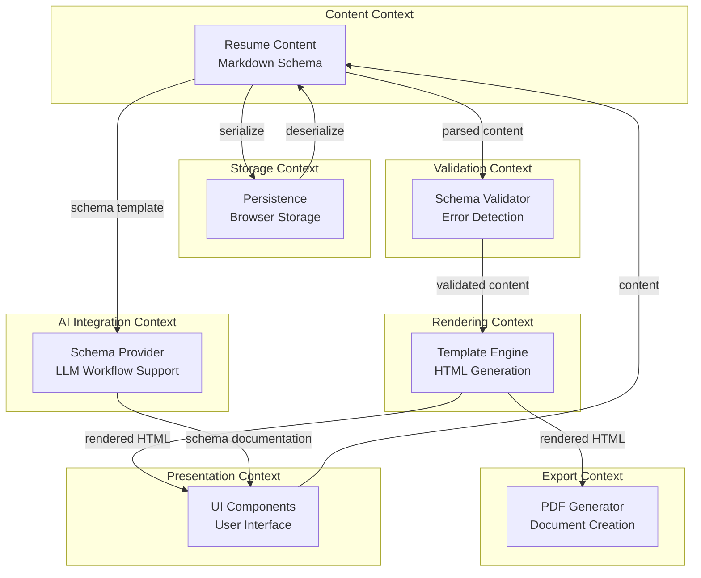
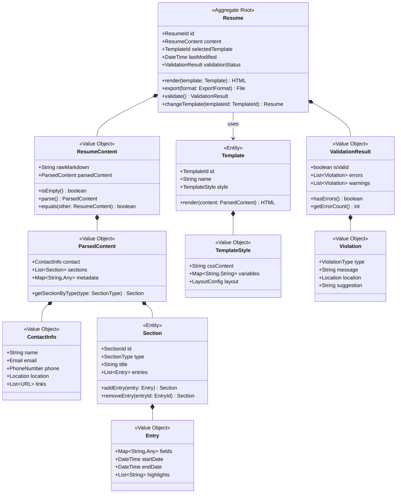
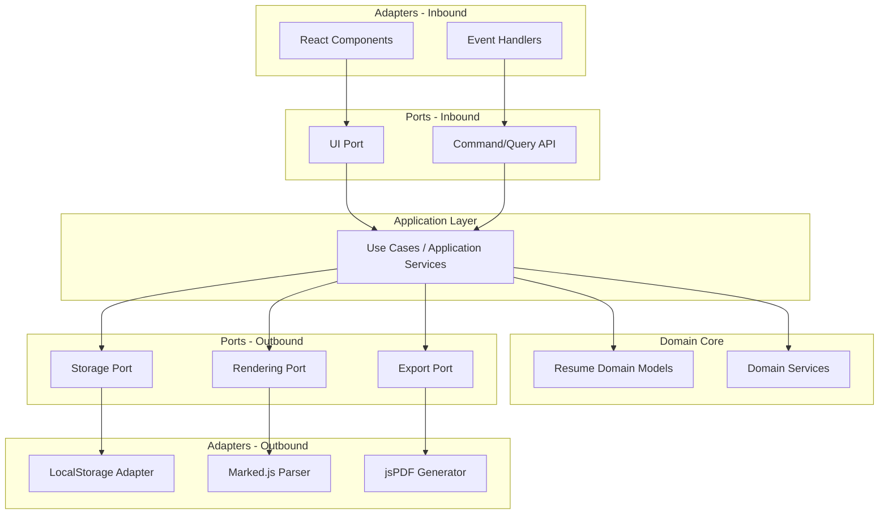
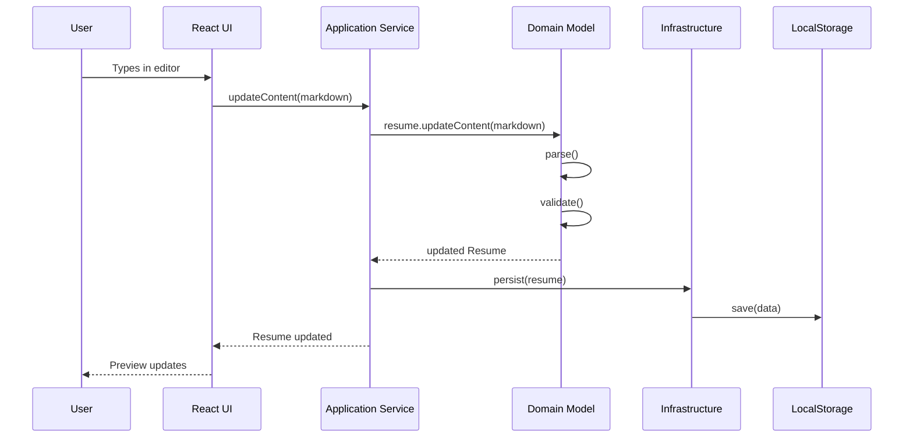
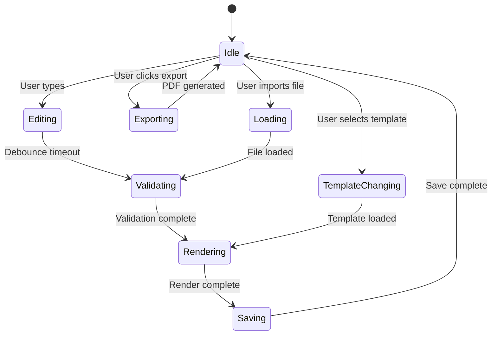

# Implementation Plan: AI-Friendly Resume Generator

**Document Version:** 1.0
**Date:** 2026-03-10
**Project:** AI-Friendly Resume Generator (Client-Side)

---

## Table of Contents

1. [Executive Summary](#1-executive-summary)
2. [Domain Analysis & Bounded Contexts](#2-domain-analysis--bounded-contexts)
3. [Core Domain Models & Entities](#3-core-domain-models--entities)
4. [Technical Architecture](#4-technical-architecture)
5. [Component Structure & Responsibilities](#5-component-structure--responsibilities)
6. [Data Flow & State Management](#6-data-flow--state-management)
7. [Technology Stack Recommendations](#7-technology-stack-recommendations)
8. [Implementation Phases](#8-implementation-phases)
9. [Key Technical Decisions & Trade-offs](#9-key-technical-decisions--trade-offs)
10. [File & Folder Structure](#10-file--folder-structure)
11. [Testing Strategy](#11-testing-strategy)
12. [Risk Mitigation](#12-risk-mitigation)

---

## 1. Executive Summary

### 1.1 Project Overview

The AI-Friendly Resume Generator is a client-side web application that separates resume content from presentation. Users write content in structured Markdown, preview it in real-time with multiple templates, and export professional PDFs. The "AI-friendly" aspect enables users to leverage external LLMs (ChatGPT, Claude, etc.) to generate schema-compliant content.

### 1.2 Architecture Philosophy

This implementation plan applies Domain-Driven Design principles to a client-side application by:
- **Identifying bounded contexts** even without backend services
- **Modeling domain entities** that represent resume concepts
- **Separating concerns** between domain logic, presentation, and infrastructure
- **Using ubiquitous language** aligned with resume creation terminology
- **Enforcing business invariants** through schema validation

### 1.3 Key Design Principles

1. **Separation of Concerns**: Content (Markdown) completely separate from presentation (Templates)
2. **Immutability**: Resume content and templates are immutable value objects
3. **Client-Side First**: All processing in browser, no server dependencies
4. **Progressive Enhancement**: Core features work, then layer enhancements
5. **Privacy by Design**: No data leaves user's device

### 1.4 Success Criteria

- User can create professional resume from scratch in < 30 minutes
- Preview latency < 100ms
- Template switching < 500ms
- PDF generation < 5 seconds
- Zero data loss incidents
- Works offline after initial load

---

## 2. Domain Analysis & Bounded Contexts

### 2.1 Domain Classification

Using DDD strategic design, we classify subdomains:

| Subdomain | Type | Strategic Value | Complexity | Justification |
|-----------|------|----------------|------------|---------------|
| Resume Content Management | **Core Domain** | High | Medium | Differentiating feature: schema-based content separation |
| Template Rendering | **Core Domain** | High | Medium | Key value: instant template switching without content loss |
| AI Schema Integration | **Core Domain** | High | Low | Unique selling point: LLM workflow enablement |
| PDF Export | **Supporting** | Medium | High | Necessary but not differentiating, technical complexity high |
| Markdown Parsing | **Generic** | Low | Low | Commodity capability using libraries |
| Local Storage | **Generic** | Low | Low | Standard browser API usage |
| UI Components | **Supporting** | Medium | Medium | Necessary for usability but not unique |

**Strategic Focus**: Invest architectural effort in Core Domains (Content Management, Templates, AI Integration) while using libraries and simple implementations for Generic and Supporting domains.

### 2.2 Bounded Contexts

Even in a client-side app, we identify distinct bounded contexts with their own models and language:



### 2.3 Context Mapping

Relationships between bounded contexts:

| Upstream Context | Downstream Context | Pattern | Description |
|------------------|-------------------|---------|-------------|
| Content Context | Validation Context | **Customer-Supplier** | Validation depends on Content schema definition |
| Validation Context | Rendering Context | **Customer-Supplier** | Renderer requires validated content |
| Rendering Context | Export Context | **Customer-Supplier** | PDF export consumes rendered HTML |
| Content Context | Storage Context | **Published Language** | Content serializes to standard Markdown format |
| Content Context | AI Integration Context | **Published Language** | Schema template is public contract for LLMs |
| All Contexts | Presentation Context | **Open Host Service** | UI consumes all contexts via well-defined interfaces |

### 2.4 Ubiquitous Language

**Content Context:**
- **Resume**: Complete document containing user's professional information
- **Section**: Major part of resume (Experience, Education, Skills)
- **Entry**: Individual item within a section (one job, one degree)
- **Schema**: Structural rules defining valid resume format
- **Markdown Content**: Raw text representation following schema

**Rendering Context:**
- **Template**: Visual design that presents resume content
- **Style**: CSS and layout rules for a template
- **Rendered HTML**: Template applied to content
- **Theme**: Collection of related templates

**Validation Context:**
- **Validation Rule**: Constraint that content must satisfy
- **Violation**: Specific instance where content breaks a rule
- **Error**: Critical violation preventing rendering
- **Warning**: Non-critical issue suggesting improvement

**Export Context:**
- **PDF Document**: Exportable file format of resume
- **Print Layout**: Page-specific formatting for PDF
- **Document Metadata**: Author, title, creation date

**AI Integration Context:**
- **Schema Template**: Example Markdown structure for LLMs
- **LLM Prompt**: Suggested instructions for AI content generation
- **Workflow Guide**: Step-by-step instructions for AI-friendly usage

---

## 3. Core Domain Models & Entities

### 3.1 Resume Domain Model



### 3.2 Aggregates and Boundaries

#### Resume Aggregate

**Aggregate Root:** `Resume`

**Entities within Aggregate:**
- `Section` (identified by position and type)

**Value Objects within Aggregate:**
- `ResumeContent`
- `ParsedContent`
- `ContactInfo`
- `Entry`
- `ValidationResult`
- `Violation`

**Invariants Protected:**
1. Resume must have valid content or be empty
2. If content exists, it must be parseable Markdown
3. Contact information must include at minimum: name and one contact method
4. Date ranges in entries must be valid (end >= start)
5. Validation result must always reflect current content state

**Consistency Boundary:**
All changes to resume content, template selection, and validation must maintain consistency within the Resume aggregate.

#### Template Aggregate

**Aggregate Root:** `Template`

**Value Objects:**
- `TemplateStyle`

**Invariants Protected:**
1. Template must have unique identifier
2. Template must have valid CSS
3. Template must support all schema-defined sections
4. Template style must be immutable once defined

### 3.3 Domain Events

Key events that occur during resume lifecycle:

```typescript
// Domain Events
interface ResumeContentChanged {
    type: 'ResumeContentChanged'
    resumeId: ResumeId
    newContent: ResumeContent
    timestamp: DateTime
}

interface TemplateChanged {
    type: 'TemplateChanged'
    resumeId: ResumeId
    oldTemplateId: TemplateId
    newTemplateId: TemplateId
    timestamp: DateTime
}

interface ValidationCompleted {
    type: 'ValidationCompleted'
    resumeId: ResumeId
    result: ValidationResult
    timestamp: DateTime
}

interface ResumePersisted {
    type: 'ResumePersisted'
    resumeId: ResumeId
    timestamp: DateTime
}

interface PDFExported {
    type: 'PDFExported'
    resumeId: ResumeId
    filename: string
    timestamp: DateTime
}

interface SchemaRequested {
    type: 'SchemaRequested'
    timestamp: DateTime
}
```

**Event Flow Example:**

```
User types in editor
  → ResumeContentChanged event
  → Trigger validation
  → ValidationCompleted event
  → Trigger auto-save
  → ResumePersisted event
  → Trigger re-render
  → Update preview
```

### 3.4 Domain Services

Services that don't naturally belong to entities:

#### 1. ResumeParser (Domain Service)

```typescript
interface ResumeParser {
    parse(markdown: string): ParsedContent
    serialize(content: ParsedContent): string
}
```

**Responsibility:** Convert between Markdown and structured content.

#### 2. SchemaValidator (Domain Service)

```typescript
interface SchemaValidator {
    validate(content: ResumeContent): ValidationResult
    validateSection(section: Section): ValidationResult
    getRequiredSections(): List<SectionType>
}
```

**Responsibility:** Enforce schema rules and business constraints.

#### 3. TemplateRenderer (Domain Service)

```typescript
interface TemplateRenderer {
    render(content: ParsedContent, template: Template): HTML
    preview(content: ParsedContent, template: Template): HTML
}
```

**Responsibility:** Apply templates to content for display.

#### 4. PDFGenerator (Domain Service)

```typescript
interface PDFGenerator {
    generate(html: HTML, options: PDFOptions): Promise<Blob>
    estimatePageCount(html: HTML): number
}
```

**Responsibility:** Convert rendered HTML to PDF format.

---

## 4. Technical Architecture

### 4.1 Hexagonal Architecture (Ports & Adapters)



### 4.2 Layer Responsibilities

#### Domain Layer (Core)

**Responsibility:** Business logic and rules, completely independent of frameworks.

**Contains:**
- Entities (Resume, Section, Template)
- Value Objects (ResumeContent, ContactInfo, Entry, etc.)
- Domain Services (Parser, Validator, Renderer)
- Domain Events
- Invariant enforcement

**Dependencies:** None (pure TypeScript)

#### Application Layer

**Responsibility:** Orchestrate domain operations, handle use cases.

**Contains:**
- Application Services / Use Cases
- Command/Query handlers
- Application-level state management
- Event bus

**Key Use Cases:**
- `UpdateResumeContent`
- `SwitchTemplate`
- `ValidateResume`
- `ExportToPDF`
- `SaveResume`
- `LoadResume`
- `GetSchemaTemplate`

**Dependencies:** Domain Layer only

#### Infrastructure Layer

**Responsibility:** Technical implementations of ports.

**Contains:**
- LocalStorage implementation
- Markdown parser wrapper (marked.js)
- PDF generation wrapper (jsPDF/html2pdf)
- Browser APIs (clipboard, file download)

**Dependencies:** Domain Layer, external libraries

#### Presentation Layer

**Responsibility:** UI rendering and user interaction.

**Contains:**
- React components
- UI state (separate from domain state)
- Event handlers
- Routing (if any)

**Dependencies:** Application Layer (through well-defined interfaces)

### 4.3 Data Flow Architecture



### 4.4 State Management Architecture

**Two-Tier State:**

1. **Domain State** (Application Layer)
   - Current resume aggregate
   - Available templates
   - Validation results
   - Managed by application services

2. **UI State** (Presentation Layer)
   - Editor cursor position
   - UI panel visibility
   - Template selector state
   - Loading indicators
   - Managed by React state/context

**State Synchronization:**

```typescript
// Domain state lives in Application context
const ApplicationContext = {
    currentResume: Resume | null,
    templates: Template[],
    validationResult: ValidationResult
}

// UI state lives in React components
const UIState = {
    editorCursorPosition: number,
    isTemplateSelectorOpen: boolean,
    isExporting: boolean,
    activePanel: 'editor' | 'preview' | 'help'
}
```

---

## 5. Component Structure & Responsibilities

### 5.1 Component Hierarchy

```
App
├── ApplicationProvider (Application Service context)
├── LayoutContainer
│   ├── Header
│   │   ├── Logo
│   │   ├── TemplateSelector
│   │   ├── ExportButton
│   │   └── HelpButton
│   ├── EditorPane
│   │   ├── MarkdownEditor
│   │   ├── EditorToolbar
│   │   └── ValidationPanel
│   ├── PreviewPane
│   │   ├── TemplatePreview
│   │   └── PreviewControls
│   └── HelpPanel
│       ├── SchemaDocumentation
│       ├── AIWorkflowGuide
│       ├── MarkdownGuide
│       └── ExampleResume
└── NotificationContainer
    └── Toast/Alert components
```

### 5.2 Core Components

#### ApplicationProvider

**Responsibility:** Provide application services and domain state to all components.

**State:**
- Current Resume aggregate
- Available Templates
- Active template ID
- Validation status

**Methods:**
- `updateContent(markdown: string)`
- `changeTemplate(templateId: TemplateId)`
- `exportToPDF(filename: string)`
- `saveResume()`
- `loadResume()`
- `getSchemaTemplate()`

#### MarkdownEditor

**Responsibility:** Content input and editing.

**Props:**
- `content: string`
- `onChange: (content: string) => void`
- `validationErrors: Violation[]`

**Features:**
- Syntax highlighting (CodeMirror or Monaco)
- Auto-save (debounced)
- Undo/Redo
- Find/Replace
- Line numbers

**Technology Options:**
- CodeMirror 6 (lightweight, extensible)
- Monaco Editor (feature-rich, larger bundle)
- Plain textarea + syntax highlighting library

#### TemplatePreview

**Responsibility:** Display rendered resume in selected template.

**Props:**
- `html: string`
- `template: Template`
- `validationResult: ValidationResult`

**Features:**
- Scroll sync with editor (optional)
- Responsive scaling
- Print preview mode

#### TemplateSelector

**Responsibility:** Allow template browsing and selection.

**Props:**
- `templates: Template[]`
- `selectedTemplateId: TemplateId`
- `onSelectTemplate: (id: TemplateId) => void`

**Features:**
- Template thumbnails
- Template names and descriptions
- Current selection indicator

#### ValidationPanel

**Responsibility:** Display validation errors and warnings.

**Props:**
- `validationResult: ValidationResult`
- `onErrorClick: (violation: Violation) => void`

**Features:**
- Error list grouped by severity
- Click to jump to error location
- Dismiss warnings
- Error counter

#### ExportButton

**Responsibility:** Trigger PDF export.

**Props:**
- `onExport: (filename: string) => Promise<void>`
- `isExporting: boolean`

**Features:**
- Loading state during export
- Filename customization
- Export options (page size, margins)

### 5.3 Component Communication

**Pattern:** Unidirectional data flow

```typescript
// Components communicate through Application Service

// Component calls application service
const { updateContent } = useApplicationContext()
updateContent(newMarkdown)

// Application service updates domain
// Domain emits event
// Application service updates React context
// Components re-render with new state
```

**No direct component-to-component communication** except parent-child props.

---

## 6. Data Flow & State Management

### 6.1 State Management Strategy

**Approach:** Context API + Domain-Driven State

**Why not Redux/Zustand?**
- Application state is simple (one Resume aggregate)
- No complex async coordination needed
- Avoid over-engineering for client-side app
- Context API sufficient for this scale

**State Structure:**

```typescript
interface ApplicationState {
    // Domain state
    resume: Resume | null
    templates: Template[]
    selectedTemplateId: TemplateId
    validationResult: ValidationResult

    // Application state
    isLoading: boolean
    error: Error | null
    lastSaved: DateTime | null

    // Computed state (derived)
    renderedHTML: string
    isValid: boolean
    hasUnsavedChanges: boolean
}
```

### 6.2 State Update Flow



### 6.3 Data Persistence Strategy

**Primary Storage:** Browser LocalStorage

**Backup Strategy:** Markdown export

**Storage Schema:**

```typescript
// LocalStorage key structure
const STORAGE_KEYS = {
    RESUME_CONTENT: 'resume:content',
    SELECTED_TEMPLATE: 'resume:selectedTemplate',
    USER_PREFERENCES: 'resume:preferences'
}

// Stored data structure
interface StoredResume {
    content: string // Raw markdown
    templateId: string
    lastModified: string // ISO datetime
    version: string // Schema version
}
```

**Auto-Save Logic:**

```typescript
// Debounced auto-save on content change
const AUTOSAVE_DELAY = 2000 // 2 seconds

useEffect(() => {
    const timeoutId = setTimeout(() => {
        saveToLocalStorage(resume)
    }, AUTOSAVE_DELAY)

    return () => clearTimeout(timeoutId)
}, [resume.content])
```

**Storage Quota Handling:**

```typescript
function saveToLocalStorage(resume: Resume): Result<void, StorageError> {
    try {
        const data = serialize(resume)
        localStorage.setItem(STORAGE_KEYS.RESUME_CONTENT, data)
        return Ok(void)
    } catch (error) {
        if (error.name === 'QuotaExceededError') {
            return Err(new StorageQuotaExceededError())
        }
        return Err(new StorageError(error))
    }
}
```

### 6.4 Event-Driven Updates

**Event Bus Pattern:**

```typescript
interface EventBus {
    publish<T extends DomainEvent>(event: T): void
    subscribe<T extends DomainEvent>(
        eventType: string,
        handler: (event: T) => void
    ): Unsubscribe
}

// Usage
eventBus.subscribe('ResumeContentChanged', (event) => {
    // Trigger validation
    validateResume(event.newContent)
})

eventBus.subscribe('ValidationCompleted', (event) => {
    // Update UI with validation results
    setValidationResult(event.result)
})
```

**Benefits:**
- Decouples components
- Clear causation chain
- Easy to add side effects (analytics, logging)
- Supports undo/redo via event sourcing (future)

---

## 7. Technology Stack Recommendations

### 7.1 Core Framework

**React 18+ with TypeScript**

**Rationale:**
- Component-based architecture fits domain modeling
- TypeScript enables strong typing for domain models
- Large ecosystem for required features
- Excellent developer experience
- Good performance for client-side rendering

**Alternatives Considered:**
- Vue 3: Good option, but React has better PDF/Markdown library ecosystem
- Svelte: Smaller bundle, but less mature ecosystem for our needs
- Vanilla JS: Too much low-level work for UI complexity

### 7.2 Build Tool

**Vite**

**Rationale:**
- Fast development server with HMR
- Optimized production builds
- Excellent TypeScript support
- Simple configuration
- Modern ESM-based approach

**Configuration:**

```typescript
// vite.config.ts
import { defineConfig } from 'vite'
import react from '@vitejs/plugin-react'

export default defineConfig({
    plugins: [react()],
    build: {
        target: 'esnext',
        minify: 'terser',
        rollupOptions: {
            output: {
                manualChunks: {
                    'react-vendor': ['react', 'react-dom'],
                    'editor': ['codemirror'],
                    'pdf': ['jspdf', 'html2canvas']
                }
            }
        }
    }
})
```

### 7.3 Markdown Parsing

**marked.js**

**Rationale:**
- Fast and lightweight
- Extensible for custom schema parsing
- Good browser support
- Active maintenance
- Simple API

**Alternatives:**
- markdown-it: More features, but heavier
- remark: Part of unified ecosystem, but more complex for our needs
- Custom parser: Too much effort, reinventing wheel

**Usage Pattern:**

```typescript
import { marked } from 'marked'

// Custom renderer for schema sections
const renderer = new marked.Renderer()
renderer.heading = (text, level) => {
    // Custom heading processing for sections
    return `<h${level} class="resume-section">${text}</h${level}>`
}

marked.setOptions({ renderer })

function parseMarkdown(markdown: string): HTML {
    return marked.parse(markdown)
}
```

### 7.4 Code Editor

**CodeMirror 6**

**Rationale:**
- Modern, modular architecture
- Excellent performance
- Built-in Markdown mode
- Extensible for custom validation highlighting
- Smaller than Monaco Editor
- Active development

**Alternatives:**
- Monaco Editor: Too heavy for our needs (3MB+)
- Ace Editor: Older, less active development
- Plain textarea: No syntax highlighting or advanced features

**Integration:**

```typescript
import { EditorView, basicSetup } from 'codemirror'
import { markdown } from '@codemirror/lang-markdown'
import { oneDark } from '@codemirror/theme-one-dark'

const editor = new EditorView({
    extensions: [
        basicSetup,
        markdown(),
        oneDark,
        EditorView.updateListener.of((update) => {
            if (update.docChanged) {
                onContentChange(update.state.doc.toString())
            }
        })
    ],
    parent: editorElement
})
```

### 7.5 PDF Generation

**html2pdf.js (wrapper around jsPDF + html2canvas)**

**Rationale:**
- Converts HTML directly to PDF
- Preserves CSS styling
- Good text quality
- Reasonable file sizes
- Client-side generation

**Alternatives:**
- jsPDF alone: Requires manual layout, too low-level
- pdfmake: Requires converting to custom document definition
- Browser Print API: Limited control, inconsistent across browsers
- react-pdf: For rendering PDFs, not generating them

**Critical Validation Needed:**

Must verify PDF quality meets professional standards:
- Text is searchable (not rasterized)
- Fonts render crisply
- Layout matches preview
- File size reasonable (< 2MB)
- ATS-compatible

**Implementation:**

```typescript
import html2pdf from 'html2pdf.js'

async function exportToPDF(
    element: HTMLElement,
    filename: string
): Promise<Blob> {
    const options = {
        margin: 0.5,
        filename: filename,
        image: { type: 'jpeg', quality: 0.95 },
        html2canvas: { scale: 2, useCORS: true },
        jsPDF: { unit: 'in', format: 'letter', orientation: 'portrait' }
    }

    return await html2pdf()
        .set(options)
        .from(element)
        .output('blob')
}
```

### 7.6 Schema Validation

**Zod**

**Rationale:**
- TypeScript-first schema validation
- Excellent error messages
- Lightweight
- Composable validators
- Type inference from schema

**Alternatives:**
- Yup: Similar features, but Zod has better TypeScript integration
- Joi: Node-focused, larger bundle
- Custom validation: Too much code to maintain

**Schema Definition:**

```typescript
import { z } from 'zod'

const ContactInfoSchema = z.object({
    name: z.string().min(1, 'Name is required'),
    email: z.string().email('Invalid email format'),
    phone: z.string().optional(),
    location: z.string().optional(),
    links: z.array(z.string().url()).optional()
})

const SectionEntrySchema = z.object({
    title: z.string().optional(),
    organization: z.string().optional(),
    startDate: z.string(),
    endDate: z.string().optional(),
    highlights: z.array(z.string())
})

const ResumeContentSchema = z.object({
    contact: ContactInfoSchema,
    summary: z.string().optional(),
    experience: z.array(SectionEntrySchema).optional(),
    education: z.array(SectionEntrySchema).optional(),
    skills: z.array(z.string()).optional()
})
```

### 7.7 Styling

**Tailwind CSS + CSS Modules**

**Rationale:**
- Tailwind for rapid UI development
- CSS Modules for template styles (isolation needed)
- No CSS-in-JS to avoid runtime cost
- Tailwind's utility-first approach speeds development

**Template Styles Pattern:**

```css
/* template-classic.module.css */
.resume {
    font-family: 'Georgia', serif;
    max-width: 8.5in;
    margin: 0 auto;
    padding: 0.5in;
}

.section-heading {
    border-bottom: 2px solid #333;
    margin-top: 1rem;
    padding-bottom: 0.25rem;
}
```

### 7.8 State Management

**React Context API + useReducer**

**Rationale:**
- Built-in, no extra dependencies
- Sufficient for application complexity
- Clear action/state pattern
- Easy testing

**Pattern:**

```typescript
interface ApplicationAction {
    type: 'UPDATE_CONTENT' | 'CHANGE_TEMPLATE' | 'SET_VALIDATION'
    payload: any
}

function applicationReducer(
    state: ApplicationState,
    action: ApplicationAction
): ApplicationState {
    switch (action.type) {
        case 'UPDATE_CONTENT':
            return {
                ...state,
                resume: state.resume.updateContent(action.payload)
            }
        // ... other cases
    }
}

const ApplicationContext = createContext<{
    state: ApplicationState
    dispatch: Dispatch<ApplicationAction>
} | null>(null)
```

### 7.9 Testing Libraries

**Unit Testing:**
- **Vitest**: Fast, Vite-native test runner
- **@testing-library/react**: Component testing
- **@testing-library/user-event**: User interaction simulation

**E2E Testing:**
- **Playwright**: Cross-browser testing, PDF validation

**Rationale:**
- Vitest integrates seamlessly with Vite
- Testing Library promotes good testing practices
- Playwright can validate PDF output quality

### 7.10 Utility Libraries

| Library | Purpose | Rationale |
|---------|---------|-----------|
| `date-fns` | Date formatting | Lightweight, tree-shakeable |
| `clsx` | Conditional classnames | Tiny, useful for template switching |
| `nanoid` | ID generation | Small, fast unique IDs |
| `dompurify` | Sanitize HTML | Security for user-generated content |

### 7.11 Complete Dependency List

```json
{
  "dependencies": {
    "react": "^18.2.0",
    "react-dom": "^18.2.0",
    "codemirror": "^6.0.0",
    "@codemirror/lang-markdown": "^6.0.0",
    "marked": "^9.0.0",
    "html2pdf.js": "^0.10.1",
    "zod": "^3.22.0",
    "date-fns": "^2.30.0",
    "clsx": "^2.0.0",
    "nanoid": "^5.0.0",
    "dompurify": "^3.0.0"
  },
  "devDependencies": {
    "@vitejs/plugin-react": "^4.0.0",
    "vite": "^5.0.0",
    "typescript": "^5.2.0",
    "vitest": "^1.0.0",
    "@testing-library/react": "^14.0.0",
    "@testing-library/user-event": "^14.5.0",
    "@playwright/test": "^1.40.0",
    "tailwindcss": "^3.3.0",
    "autoprefixer": "^10.4.0",
    "postcss": "^8.4.0"
  }
}
```

---

## 8. Implementation Phases

Implementation aligned with the 9-phase user story prioritization.

### Phase 1: MVP - Core Functionality (Weeks 1-3)

**Goal:** Prove technical feasibility and deliver end-to-end basic workflow.

**Stories:** 1.1, 1.2, 2.1, 2.2, 2.3, 3.1, 4.1, 4.2, 4.3, 6.1

**Deliverables:**
1. Domain models (Resume, ResumeContent, Template)
2. Basic markdown editor (plain textarea initially)
3. Real-time preview with one default template
4. Markdown parser integration
5. PDF export functionality
6. Auto-save to localStorage
7. Split-pane layout
8. Welcome message

**Technical Risks to Validate:**
- PDF generation quality acceptable?
- Preview latency acceptable?
- Markdown parsing handles resume schema?

**Success Criteria:**
- User can write markdown, see preview, export PDF
- PDF quality suitable for job applications
- Preview updates < 500ms
- Auto-save works reliably

**Implementation Tasks:**

```
Week 1:
- [ ] Project setup (Vite, React, TypeScript)
- [ ] Domain model implementation (Resume, Content, Template)
- [ ] Basic React component structure
- [ ] LocalStorage persistence service
- [ ] Application context setup

Week 2:
- [ ] Markdown parser integration
- [ ] Basic template CSS (Classic template)
- [ ] Real-time preview rendering
- [ ] Split-pane layout implementation
- [ ] Auto-save implementation

Week 3:
- [ ] PDF export integration (html2pdf.js)
- [ ] PDF quality testing and tuning
- [ ] Welcome message component
- [ ] Basic error handling
- [ ] End-to-end testing
```

### Phase 2: AI-Friendly Workflow (Weeks 4-5)

**Goal:** Implement differentiating feature enabling LLM collaboration.

**Stories:** 5.1, 5.2, 5.3, 5.5, 6.4, 6.5

**Deliverables:**
1. Schema template definition
2. Schema documentation component
3. Copy-to-clipboard functionality
4. LLM workflow guide
5. Example resume content
6. Large content paste handling

**Implementation Tasks:**

```
Week 4:
- [ ] Define formal Markdown schema
- [ ] Create schema template with examples
- [ ] Schema documentation component
- [ ] Clipboard API integration
- [ ] LLM workflow instruction content

Week 5:
- [ ] Example resume content creation
- [ ] Help panel component
- [ ] Schema viewer/copier component
- [ ] Large paste optimization
- [ ] User testing with actual LLM workflow
```

### Phase 3: Template Flexibility (Weeks 6-7)

**Goal:** Enable multiple professional templates with instant switching.

**Stories:** 3.2, 3.3, 3.4, 3.5, 4.4, 2.4, 2.5

**Deliverables:**
1. Template system architecture
2. At least 3 professional templates (Classic, Modern, Minimal)
3. Template selector UI
4. Template persistence
5. Custom filename for export
6. Independent scrolling

**Template Designs:**

```
Templates to implement:
1. Classic: Traditional serif fonts, clean layout, conservative
2. Modern: Sans-serif, two-column layout, contemporary
3. Minimal: Sparse design, lots of whitespace, simple
```

**Implementation Tasks:**

```
Week 6:
- [ ] Template abstraction layer
- [ ] Template registry/loader
- [ ] Template selector component
- [ ] Template switching logic
- [ ] Classic template CSS

Week 7:
- [ ] Modern template CSS
- [ ] Minimal template CSS
- [ ] Template persistence
- [ ] Custom filename dialog
- [ ] Template preview thumbnails
```

### Phase 4: Data Safety & Portability (Week 8)

**Goal:** Build user trust through data control and backup.

**Stories:** 7.1, 7.2, 7.4, 7.5, 8.5, 1.3

**Deliverables:**
1. Markdown file export
2. Markdown file import
3. Storage warning messages
4. Storage error handling
5. Unsaved changes warning
6. Clear content functionality

**Implementation Tasks:**

```
Week 8:
- [ ] File export service (Blob/download)
- [ ] File import service (FileReader)
- [ ] Storage quota monitoring
- [ ] beforeunload warning
- [ ] Storage error UI
- [ ] Import validation
- [ ] Clear content with confirmation
```

### Phase 5: Validation & Error Prevention (Week 9)

**Goal:** Guide users to create valid, schema-compliant content.

**Stories:** 9.1, 9.2, 9.3, 9.4, 7.3, 5.4

**Deliverables:**
1. Schema validation with Zod
2. Real-time validation
3. Validation status indicator
4. Error list panel
5. Import validation feedback
6. Example LLM prompts

**Validation Rules:**

```typescript
// Required sections
- Contact info (name + email or phone)

// Format validation
- Valid email format
- Valid date formats (YYYY-MM or YYYY-MM-DD)
- End date >= start date

// Structural validation
- Headings follow hierarchy
- Lists properly formatted
- Links are valid URLs
```

**Implementation Tasks:**

```
Week 9:
- [ ] Zod schema definitions
- [ ] Validation service implementation
- [ ] Validation status component
- [ ] Error panel component
- [ ] Inline error indicators (nice-to-have)
- [ ] Example LLM prompts content
- [ ] Import validation integration
```

### Phase 6: UX Refinement (Week 10)

**Goal:** Polish interface for better usability.

**Stories:** 4.5, 6.2, 6.3, 8.6, 8.10, 1.4, 9.5

**Deliverables:**
1. Export loading feedback
2. Help documentation
3. Markdown syntax guide
4. Undo/redo
5. Template thumbnails
6. Character counter
7. Inline error indicators

**Implementation Tasks:**

```
Week 10:
- [ ] Export loading states
- [ ] Help panel content
- [ ] Markdown guide component
- [ ] Undo/redo implementation
- [ ] Template thumbnail generation
- [ ] Character counter
- [ ] Inline error highlighting
```

### Phase 7: Enhanced Editing (Week 11)

**Goal:** Power-user features for efficiency.

**Stories:** 8.7, 8.8, 8.9, 8.3, 8.4

**Deliverables:**
1. Find/replace
2. Line numbers
3. Syntax highlighting
4. Keyboard navigation
5. Dark mode

**CodeMirror Upgrade:**

Replace basic textarea with full CodeMirror 6 editor.

**Implementation Tasks:**

```
Week 11:
- [ ] Upgrade to CodeMirror 6
- [ ] Find/replace extension
- [ ] Line numbers configuration
- [ ] Markdown syntax highlighting
- [ ] Keyboard shortcuts
- [ ] Dark mode theme toggle
- [ ] Theme persistence
```

### Phase 8: Accessibility & Compatibility (Week 12)

**Goal:** Ensure inclusive design and broad compatibility.

**Stories:** 11.1, 11.2, 11.3, 11.4, 11.5, 8.1, 8.2, 10.4

**Deliverables:**
1. Screen reader support
2. Keyboard-only workflows
3. High contrast mode support
4. Text zoom support
5. Alt text for images
6. Tablet responsive layout
7. Mobile view mode
8. Cross-browser compatibility

**Accessibility Testing:**

```
WCAG 2.1 AA Compliance:
- [ ] Keyboard navigation throughout
- [ ] Focus indicators visible
- [ ] ARIA labels on controls
- [ ] Alt text on images
- [ ] Color contrast ratios
- [ ] Screen reader announcements
- [ ] Form labels
- [ ] Error identification
```

**Implementation Tasks:**

```
Week 12:
- [ ] ARIA labels and roles
- [ ] Keyboard navigation audit
- [ ] High contrast CSS
- [ ] Responsive layout (tablet/mobile)
- [ ] Cross-browser testing
- [ ] Accessibility audit (axe-core)
- [ ] Screen reader testing
```

### Phase 9: Performance & Reliability (Week 13)

**Goal:** Optimize for scale and edge cases.

**Stories:** 10.1, 10.2, 10.3, 10.5

**Deliverables:**
1. Large content handling
2. Debounced preview updates
3. Offline functionality (PWA)
4. Storage quota handling

**Performance Targets:**

```
- Preview update: < 100ms (p95)
- Template switch: < 500ms
- PDF export: < 5 seconds
- Initial load: < 3 seconds
- Bundle size: < 500KB (gzipped)
```

**Implementation Tasks:**

```
Week 13:
- [ ] Performance profiling
- [ ] Preview debouncing optimization
- [ ] Large content stress testing
- [ ] Code splitting
- [ ] PWA configuration
- [ ] Service worker for offline
- [ ] Storage quota monitoring
- [ ] Bundle size optimization
```

### Phase 10: Launch Preparation (Week 14)

**Goal:** Final polish and deployment.

**Deliverables:**
1. Production build optimization
2. Documentation
3. Deployment pipeline
4. Analytics (privacy-respecting)
5. Error monitoring

**Launch Checklist:**

```
- [ ] All Phase 1-9 features tested
- [ ] Cross-browser testing complete
- [ ] Accessibility audit passed
- [ ] Performance benchmarks met
- [ ] User documentation written
- [ ] Privacy policy (if needed)
- [ ] Deployment to hosting (Netlify/Vercel)
- [ ] Domain configuration
- [ ] Analytics setup (Plausible/Fathom)
- [ ] Error monitoring (Sentry)
- [ ] Backup/rollback plan
```

---

## 9. Key Technical Decisions & Trade-offs

### 9.1 Client-Side Only Architecture

**Decision:** All processing in browser, zero backend.

**Benefits:**
- User privacy: no data transmitted
- No server costs or maintenance
- Offline capability after initial load
- No authentication complexity
- Instant deployment (static hosting)

**Trade-offs:**
- Limited by browser capabilities
- Can't leverage server-side PDF generation (better quality)
- No cloud sync/backup
- Storage quota limitations
- All assets must be bundled

**Mitigation:**
- Careful library selection for quality
- Educate users to export backups
- Optimize bundle size aggressively

### 9.2 Markdown Schema Enforcement

**Decision:** Enforce structured markdown schema vs free-form markdown.

**Benefits:**
- Consistent parsing and rendering
- Template compatibility guaranteed
- Validation possible
- LLM output standardized
- Easier to maintain

**Trade-offs:**
- Learning curve for users
- Less flexible than free-form
- Schema evolution complexity
- Potential user frustration with restrictions

**Mitigation:**
- Excellent documentation and examples
- Helpful error messages
- Schema flexible enough for variety
- Example content to copy
- LLM workflow reduces schema burden

### 9.3 PDF Generation Approach

**Decision:** html2pdf.js (HTML → Canvas → PDF) vs manual PDF construction.

**Benefits:**
- Preserves visual design from preview
- CSS-based templates easier to design
- Preview = PDF guarantee
- Faster development

**Trade-offs:**
- Text might be rasterized (ATS issue)
- Larger file sizes
- Slower generation
- Less control over PDF structure

**Mitigation:**
- Extensive testing of PDF quality
- Ensure text is searchable
- Optimize settings for text rendering
- Benchmark file sizes
- Have fallback plan (jsPDF direct) if quality insufficient

**Critical Validation:** Must verify in Phase 1 that quality is acceptable.

### 9.4 State Management Complexity

**Decision:** Context API + Reducer vs Redux/Zustand.

**Benefits:**
- No extra dependencies
- Simpler mental model
- Sufficient for app complexity
- Less boilerplate

**Trade-offs:**
- No dev tools like Redux DevTools
- Manual optimization needed for re-renders
- Less structured than Redux patterns
- Scaling limitations (not applicable here)

**Mitigation:**
- Well-structured reducers
- Memoization where needed
- Custom dev logging in development
- Clear action/state types

### 9.5 Editor Choice

**Decision:** CodeMirror 6 vs Monaco vs plain textarea.

**Phases:**
- MVP: Plain textarea (fast to implement)
- Phase 7: Upgrade to CodeMirror 6

**Benefits:**
- Progressive enhancement
- Validate need before investment
- CodeMirror smaller than Monaco
- Modern architecture

**Trade-offs:**
- Migration work in Phase 7
- Temporary lack of advanced features
- User expectation management

**Rationale:**
- Prove core value first (content → template → PDF)
- Add editor features once validated
- Avoid over-engineering MVP

### 9.6 Template Design Approach

**Decision:** CSS-based templates vs programmatic layout.

**Benefits:**
- Designers can create templates
- Easy to preview in browser
- Leverage CSS print media queries
- Visual consistency with preview

**Trade-offs:**
- CSS print issues across browsers
- Limited layout control vs code
- PDF generation constraints

**Mitigation:**
- Test templates extensively
- Print-specific CSS media queries
- Template design guidelines
- Fallback styles

### 9.7 Offline Capability

**Decision:** Progressive Web App (PWA) in Phase 9 vs never.

**Benefits:**
- Installable like native app
- Fully offline after first load
- Better UX for frequent users
- Competitive differentiator

**Trade-offs:**
- Service worker complexity
- Cache management
- Update strategy complexity

**Approach:**
- Defer to Phase 9
- Not blocking for MVP
- Adds significant value when ready

### 9.8 Bundle Size vs Features

**Decision:** Prioritize small bundle in MVP, optimize in Phase 9.

**Strategy:**

```
MVP Target: < 300KB gzipped
- React + React DOM: ~130KB
- Marked.js: ~20KB
- html2pdf.js: ~100KB
- App code: ~50KB
Total: ~300KB

Phase 7 (with CodeMirror): < 500KB gzipped
- Add CodeMirror: ~150KB
Total: ~450KB

Final (all features): < 600KB gzipped
```

**Techniques:**
- Code splitting by route
- Lazy load help documentation
- Lazy load template selector
- Tree shaking
- Minification

### 9.9 TypeScript Strictness

**Decision:** Strict TypeScript from day one.

**Benefits:**
- Catches errors early
- Better IDE support
- Self-documenting code
- Easier refactoring
- Domain model accuracy

**Trade-offs:**
- Slower initial development
- Learning curve
- More verbose code

**Configuration:**

```json
{
  "compilerOptions": {
    "strict": true,
    "noImplicitAny": true,
    "strictNullChecks": true,
    "strictFunctionTypes": true,
    "noUnusedLocals": true,
    "noUnusedParameters": true,
    "noImplicitReturns": true
  }
}
```

### 9.10 Schema Versioning

**Decision:** Include schema version in stored data.

**Rationale:**
- Schema will evolve
- Need migration path
- Backward compatibility

**Approach:**

```typescript
interface StoredResume {
    version: string // e.g., "1.0"
    content: string
    templateId: string
    lastModified: string
}

function migrate(stored: StoredResume): StoredResume {
    if (stored.version === "1.0") {
        // No migration needed
        return stored
    }
    // Future migrations
}
```

---

## 10. File & Folder Structure

### 10.1 Project Structure

```
ai-friendly-resume-generator/
├── public/
│   ├── index.html
│   ├── manifest.json (PWA)
│   └── assets/
│       ├── icons/
│       └── template-thumbnails/
├── src/
│   ├── domain/                      # Domain Layer (Pure TS)
│   │   ├── models/
│   │   │   ├── Resume.ts           # Aggregate Root
│   │   │   ├── ResumeContent.ts    # Value Object
│   │   │   ├── ParsedContent.ts    # Value Object
│   │   │   ├── Section.ts          # Entity
│   │   │   ├── ContactInfo.ts      # Value Object
│   │   │   ├── Template.ts         # Entity
│   │   │   └── ValidationResult.ts # Value Object
│   │   ├── services/
│   │   │   ├── ResumeParser.ts     # Domain Service
│   │   │   ├── SchemaValidator.ts  # Domain Service
│   │   │   └── TemplateRenderer.ts # Domain Service
│   │   ├── events/
│   │   │   └── DomainEvents.ts     # Event definitions
│   │   └── types/
│   │       └── index.ts            # Shared domain types
│   ├── application/                 # Application Layer
│   │   ├── services/
│   │   │   ├── ResumeService.ts    # Main application service
│   │   │   ├── TemplateService.ts
│   │   │   ├── ExportService.ts
│   │   │   └── SchemaService.ts
│   │   ├── state/
│   │   │   ├── ApplicationContext.tsx
│   │   │   ├── ApplicationReducer.ts
│   │   │   └── ApplicationState.ts
│   │   ├── hooks/
│   │   │   ├── useResume.ts
│   │   │   ├── useTemplates.ts
│   │   │   ├── useValidation.ts
│   │   │   └── useExport.ts
│   │   └── ports/                   # Interface definitions
│   │       ├── IStoragePort.ts
│   │       ├── IParserPort.ts
│   │       ├── IExportPort.ts
│   │       └── IRendererPort.ts
│   ├── infrastructure/              # Infrastructure Layer
│   │   ├── storage/
│   │   │   ├── LocalStorageAdapter.ts
│   │   │   └── StorageKeys.ts
│   │   ├── parsers/
│   │   │   └── MarkedParser.ts     # marked.js wrapper
│   │   ├── exporters/
│   │   │   └── PDFExporter.ts      # html2pdf.js wrapper
│   │   └── browser/
│   │       ├── ClipboardService.ts
│   │       └── FileService.ts
│   ├── presentation/                # Presentation Layer
│   │   ├── components/
│   │   │   ├── layout/
│   │   │   │   ├── App.tsx
│   │   │   │   ├── Header.tsx
│   │   │   │   ├── LayoutContainer.tsx
│   │   │   │   └── NotificationContainer.tsx
│   │   │   ├── editor/
│   │   │   │   ├── MarkdownEditor.tsx
│   │   │   │   ├── EditorToolbar.tsx
│   │   │   │   └── EditorPane.tsx
│   │   │   ├── preview/
│   │   │   │   ├── TemplatePreview.tsx
│   │   │   │   ├── PreviewPane.tsx
│   │   │   │   └── PreviewControls.tsx
│   │   │   ├── validation/
│   │   │   │   ├── ValidationPanel.tsx
│   │   │   │   ├── ValidationStatus.tsx
│   │   │   │   └── ErrorList.tsx
│   │   │   ├── templates/
│   │   │   │   ├── TemplateSelector.tsx
│   │   │   │   └── TemplateThumbnail.tsx
│   │   │   ├── export/
│   │   │   │   ├── ExportButton.tsx
│   │   │   │   └── ExportDialog.tsx
│   │   │   ├── help/
│   │   │   │   ├── HelpPanel.tsx
│   │   │   │   ├── SchemaDocumentation.tsx
│   │   │   │   ├── AIWorkflowGuide.tsx
│   │   │   │   ├── MarkdownGuide.tsx
│   │   │   │   └── ExampleResume.tsx
│   │   │   └── shared/
│   │   │       ├── Button.tsx
│   │   │       ├── Modal.tsx
│   │   │       └── Toast.tsx
│   │   ├── hooks/
│   │   │   └── ui/                  # UI-specific hooks
│   │   │       ├── useTheme.ts
│   │   │       └── useModal.ts
│   │   └── styles/
│   │       └── globals.css
│   ├── templates/                   # Template CSS
│   │   ├── classic/
│   │   │   ├── template.module.css
│   │   │   └── template.config.ts
│   │   ├── modern/
│   │   │   ├── template.module.css
│   │   │   └── template.config.ts
│   │   └── minimal/
│   │       ├── template.module.css
│   │       └── template.config.ts
│   ├── schema/                      # Schema definitions
│   │   ├── resume-schema.ts        # Zod schema
│   │   ├── schema-template.md      # Template for LLMs
│   │   └── schema-examples.md      # Example resumes
│   ├── utils/
│   │   ├── EventBus.ts
│   │   ├── Logger.ts
│   │   └── helpers.ts
│   ├── main.tsx                     # Entry point
│   └── vite-env.d.ts
├── tests/
│   ├── unit/
│   │   ├── domain/
│   │   │   ├── Resume.test.ts
│   │   │   └── SchemaValidator.test.ts
│   │   └── application/
│   │       └── ResumeService.test.ts
│   ├── integration/
│   │   ├── export.test.ts
│   │   └── storage.test.ts
│   └── e2e/
│       ├── basic-workflow.spec.ts
│       └── pdf-export.spec.ts
├── docs/
│   ├── architecture.md
│   ├── schema-specification.md
│   └── api-reference.md
├── .github/
│   └── workflows/
│       └── ci.yml
├── package.json
├── tsconfig.json
├── vite.config.ts
├── tailwind.config.js
├── vitest.config.ts
├── playwright.config.ts
└── README.md
```

### 10.2 Key Directory Explanations

**`src/domain/`**
- Pure TypeScript, no framework dependencies
- Contains business logic and rules
- Highly testable in isolation
- No imports from other layers

**`src/application/`**
- Orchestrates domain operations
- Contains use cases
- Manages application state
- Defines ports (interfaces) for infrastructure

**`src/infrastructure/`**
- Implements ports defined in application layer
- Wraps external libraries
- Browser API interactions
- Can be swapped without changing domain/application

**`src/presentation/`**
- React components
- UI state (not domain state)
- Event handlers
- Styles

**`src/templates/`**
- CSS for each template
- Template configuration
- Isolated from main application code

**`src/schema/`**
- Zod validation schemas
- Schema template for LLMs
- Example resumes

### 10.3 Import Rules

**Layered Architecture Enforcement:**

```typescript
// ✅ Allowed: Domain imports nothing
// domain/models/Resume.ts
import { ResumeContent } from './ResumeContent'

// ✅ Allowed: Application imports domain
// application/services/ResumeService.ts
import { Resume } from '@/domain/models/Resume'

// ✅ Allowed: Infrastructure implements application ports
// infrastructure/storage/LocalStorageAdapter.ts
import { IStoragePort } from '@/application/ports/IStoragePort'

// ✅ Allowed: Presentation imports application
// presentation/components/Editor.tsx
import { useResume } from '@/application/hooks/useResume'

// ❌ Forbidden: Domain imports application
// domain/models/Resume.ts
import { ResumeService } from '@/application/services/ResumeService' // NO!

// ❌ Forbidden: Domain imports infrastructure
// domain/models/Resume.ts
import { LocalStorageAdapter } from '@/infrastructure/storage/LocalStorageAdapter' // NO!
```

**Path Aliases (tsconfig.json):**

```json
{
  "compilerOptions": {
    "baseUrl": ".",
    "paths": {
      "@/*": ["src/*"],
      "@domain/*": ["src/domain/*"],
      "@application/*": ["src/application/*"],
      "@infrastructure/*": ["src/infrastructure/*"],
      "@presentation/*": ["src/presentation/*"]
    }
  }
}
```

---

## 11. Testing Strategy

### 11.1 Testing Pyramid

```
        /\
       /  \  E2E Tests (10%)
      /____\
     /      \  Integration Tests (20%)
    /________\
   /          \
  / Unit Tests \ (70%)
 /______________\
```

### 11.2 Unit Testing

**Scope:** Domain models, services, utilities

**Framework:** Vitest

**Coverage Target:** 90%+ for domain layer

**Example Tests:**

```typescript
// tests/unit/domain/Resume.test.ts
import { describe, it, expect } from 'vitest'
import { Resume } from '@/domain/models/Resume'
import { ResumeContent } from '@/domain/models/ResumeContent'

describe('Resume', () => {
    describe('updateContent', () => {
        it('should update content and trigger validation', () => {
            const resume = Resume.create()
            const newContent = ResumeContent.fromMarkdown('# John Doe\n...')

            const updated = resume.updateContent(newContent)

            expect(updated.content).toBe(newContent)
            expect(updated.lastModified).toBeInstanceOf(Date)
        })

        it('should preserve template selection when updating content', () => {
            const resume = Resume.create()
                .changeTemplate('modern')

            const updated = resume.updateContent(
                ResumeContent.fromMarkdown('...')
            )

            expect(updated.selectedTemplate).toBe('modern')
        })
    })

    describe('validate', () => {
        it('should detect missing required fields', () => {
            const content = ResumeContent.fromMarkdown('# Incomplete Resume')
            const resume = Resume.create().updateContent(content)

            const result = resume.validate()

            expect(result.hasErrors()).toBe(true)
            expect(result.errors).toContainEqual(
                expect.objectContaining({
                    type: 'MISSING_REQUIRED_FIELD',
                    message: expect.stringContaining('email')
                })
            )
        })
    })
})
```

```typescript
// tests/unit/domain/SchemaValidator.test.ts
import { describe, it, expect } from 'vitest'
import { SchemaValidator } from '@/domain/services/SchemaValidator'

describe('SchemaValidator', () => {
    const validator = new SchemaValidator()

    it('should pass valid resume content', () => {
        const validContent = `
# John Doe
Email: john@example.com
Phone: (555) 123-4567

## Experience
### Software Engineer | Acme Corp | 2020-01 to Present
- Built awesome things
        `

        const result = validator.validate(validContent)

        expect(result.isValid).toBe(true)
        expect(result.errors).toHaveLength(0)
    })

    it('should detect invalid email format', () => {
        const invalidContent = `
# John Doe
Email: invalid-email
        `

        const result = validator.validate(invalidContent)

        expect(result.isValid).toBe(false)
        expect(result.errors).toContainEqual(
            expect.objectContaining({
                type: 'INVALID_FORMAT',
                field: 'email'
            })
        )
    })
})
```

### 11.3 Integration Testing

**Scope:** Application services, infrastructure adapters

**Framework:** Vitest

**Coverage Target:** 70%+

**Example Tests:**

```typescript
// tests/integration/storage.test.ts
import { describe, it, expect, beforeEach } from 'vitest'
import { ResumeService } from '@/application/services/ResumeService'
import { LocalStorageAdapter } from '@/infrastructure/storage/LocalStorageAdapter'

describe('Resume Persistence', () => {
    let service: ResumeService
    let storage: LocalStorageAdapter

    beforeEach(() => {
        localStorage.clear()
        storage = new LocalStorageAdapter()
        service = new ResumeService(storage)
    })

    it('should save and load resume from localStorage', async () => {
        const markdown = '# John Doe\nEmail: john@example.com'

        await service.updateContent(markdown)
        await service.save()

        const loaded = await service.load()

        expect(loaded.content.rawMarkdown).toBe(markdown)
    })

    it('should handle storage quota exceeded', async () => {
        // Mock localStorage to simulate quota error
        const originalSetItem = localStorage.setItem
        localStorage.setItem = () => {
            throw new DOMException('QuotaExceededError')
        }

        await expect(service.save()).rejects.toThrow('Storage quota exceeded')

        localStorage.setItem = originalSetItem
    })
})
```

```typescript
// tests/integration/export.test.ts
import { describe, it, expect } from 'vitest'
import { ExportService } from '@/application/services/ExportService'
import { PDFExporter } from '@/infrastructure/exporters/PDFExporter'

describe('PDF Export', () => {
    it('should generate searchable PDF', async () => {
        const html = '<h1>John Doe</h1><p>Software Engineer</p>'
        const exporter = new PDFExporter()
        const service = new ExportService(exporter)

        const blob = await service.exportToPDF(html, 'resume.pdf')

        expect(blob.type).toBe('application/pdf')
        expect(blob.size).toBeGreaterThan(0)

        // Verify text is searchable (not rasterized)
        const arrayBuffer = await blob.arrayBuffer()
        const text = new TextDecoder().decode(arrayBuffer)
        expect(text).toContain('John Doe')
    })
})
```

### 11.4 E2E Testing

**Scope:** Complete user workflows

**Framework:** Playwright

**Coverage Target:** Critical paths only

**Example Tests:**

```typescript
// tests/e2e/basic-workflow.spec.ts
import { test, expect } from '@playwright/test'

test.describe('Resume Creation Workflow', () => {
    test('user can create resume from scratch', async ({ page }) => {
        await page.goto('/')

        // Welcome message appears
        await expect(page.getByText('Create professional resumes')).toBeVisible()

        // Type in editor
        const editor = page.getByRole('textbox', { name: /editor/i })
        await editor.fill(`
# John Doe
Email: john@example.com
Phone: (555) 123-4567

## Experience
### Software Engineer | Acme Corp | 2020-01 to Present
- Built React applications
- Improved performance by 50%
        `)

        // Preview updates
        const preview = page.getByRole('region', { name: /preview/i })
        await expect(preview.getByText('John Doe')).toBeVisible()
        await expect(preview.getByText('Software Engineer')).toBeVisible()

        // Validation passes
        await expect(page.getByText(/validation passed/i)).toBeVisible()
    })

    test('user can switch templates', async ({ page }) => {
        await page.goto('/')

        // Fill content
        await page.getByRole('textbox').fill('# John Doe\n...')

        // Open template selector
        await page.getByRole('button', { name: /template/i }).click()

        // Select Modern template
        await page.getByRole('button', { name: /modern/i }).click()

        // Preview updates with new template
        const preview = page.getByRole('region', { name: /preview/i })
        await expect(preview).toHaveClass(/template-modern/)
    })

    test('user can export PDF', async ({ page }) => {
        await page.goto('/')

        // Fill content
        await page.getByRole('textbox').fill('# John Doe\nEmail: john@example.com')

        // Click export
        const downloadPromise = page.waitForEvent('download')
        await page.getByRole('button', { name: /export pdf/i }).click()

        // PDF downloads
        const download = await downloadPromise
        expect(download.suggestedFilename()).toMatch(/\.pdf$/)
    })
})
```

```typescript
// tests/e2e/ai-workflow.spec.ts
import { test, expect } from '@playwright/test'

test.describe('AI-Friendly Workflow', () => {
    test('user can copy schema template', async ({ page, context }) => {
        await context.grantPermissions(['clipboard-read', 'clipboard-write'])
        await page.goto('/')

        // Open help panel
        await page.getByRole('button', { name: /help/i }).click()

        // Navigate to schema section
        await page.getByText('Schema Template').click()

        // Copy schema
        await page.getByRole('button', { name: /copy schema/i }).click()

        // Verify clipboard
        const clipboardText = await page.evaluate(() =>
            navigator.clipboard.readText()
        )
        expect(clipboardText).toContain('# Your Name')
        expect(clipboardText).toContain('Email:')
        expect(clipboardText).toContain('## Experience')
    })

    test('user can paste LLM-generated content', async ({ page }) => {
        await page.goto('/')

        const llmGeneratedContent = `
# Jane Smith
Email: jane@example.com
Phone: (555) 987-6543

## Summary
Experienced software engineer with 5 years in web development.

## Experience
### Senior Developer | TechCo | 2021-01 to Present
- Led team of 5 developers
- Migrated legacy systems to microservices

### Developer | StartupXYZ | 2019-01 to 2021-01
- Built customer-facing web applications
- Reduced load times by 60%
        `

        const editor = page.getByRole('textbox')
        await editor.fill(llmGeneratedContent)

        // Preview renders correctly
        const preview = page.getByRole('region', { name: /preview/i })
        await expect(preview.getByText('Jane Smith')).toBeVisible()
        await expect(preview.getByText('TechCo')).toBeVisible()

        // No validation errors
        await expect(page.getByText(/error/i)).not.toBeVisible()
    })
})
```

### 11.5 PDF Quality Testing

**Special Focus:** PDF export must meet professional standards.

```typescript
// tests/integration/pdf-quality.test.ts
import { test, expect } from '@playwright/test'
import pdf from 'pdf-parse'

test.describe('PDF Quality', () => {
    test('PDF text is searchable', async ({ page }) => {
        await page.goto('/')
        await page.getByRole('textbox').fill('# John Doe\nSoftware Engineer')

        const download = await page.getByRole('button', { name: /export/i }).click()
        const buffer = await download.createReadStream()

        const data = await pdf(buffer)
        expect(data.text).toContain('John Doe')
        expect(data.text).toContain('Software Engineer')
    })

    test('PDF page count is correct', async ({ page }) => {
        // Long content
        const longContent = '# John Doe\n' + '\n## Experience\n'.repeat(50)

        await page.goto('/')
        await page.getByRole('textbox').fill(longContent)

        const download = await page.getByRole('button', { name: /export/i }).click()
        const buffer = await download.createReadStream()

        const data = await pdf(buffer)
        expect(data.numpages).toBeGreaterThan(1)
    })

    test('PDF file size is reasonable', async ({ page }) => {
        await page.goto('/')
        await page.getByRole('textbox').fill('# John Doe\nEmail: john@example.com')

        const download = await page.getByRole('button', { name: /export/i }).click()
        const buffer = await download.createReadStream()

        expect(buffer.length).toBeLessThan(2 * 1024 * 1024) // < 2MB
    })
})
```

### 11.6 Accessibility Testing

```typescript
// tests/e2e/accessibility.spec.ts
import { test, expect } from '@playwright/test'
import AxeBuilder from '@axe-core/playwright'

test.describe('Accessibility', () => {
    test('should not have WCAG violations', async ({ page }) => {
        await page.goto('/')

        const results = await new AxeBuilder({ page })
            .withTags(['wcag2a', 'wcag2aa'])
            .analyze()

        expect(results.violations).toEqual([])
    })

    test('keyboard navigation works', async ({ page }) => {
        await page.goto('/')

        // Tab through interactive elements
        await page.keyboard.press('Tab') // Editor
        await expect(page.getByRole('textbox')).toBeFocused()

        await page.keyboard.press('Tab') // Template selector
        await expect(page.getByRole('button', { name: /template/i })).toBeFocused()

        await page.keyboard.press('Tab') // Export button
        await expect(page.getByRole('button', { name: /export/i })).toBeFocused()
    })
})
```

### 11.7 Test Coverage Goals

| Layer | Target Coverage | Priority |
|-------|----------------|----------|
| Domain Models | 95% | Highest |
| Domain Services | 90% | Highest |
| Application Services | 85% | High |
| Infrastructure Adapters | 70% | Medium |
| React Components | 60% | Medium |
| E2E Critical Paths | 100% | High |

### 11.8 CI/CD Testing Pipeline

```yaml
# .github/workflows/ci.yml
name: CI

on: [push, pull_request]

jobs:
  test:
    runs-on: ubuntu-latest

    steps:
      - uses: actions/checkout@v3

      - name: Setup Node
        uses: actions/setup-node@v3
        with:
          node-version: '18'
          cache: 'npm'

      - name: Install dependencies
        run: npm ci

      - name: Type check
        run: npm run type-check

      - name: Lint
        run: npm run lint

      - name: Unit tests
        run: npm run test:unit -- --coverage

      - name: Integration tests
        run: npm run test:integration

      - name: Build
        run: npm run build

      - name: E2E tests
        run: npm run test:e2e

      - name: Upload coverage
        uses: codecov/codecov-action@v3
        with:
          files: ./coverage/coverage-final.json
```

---

## 12. Risk Mitigation

### 12.1 Technical Risks

#### Risk 1: PDF Quality Insufficient

**Likelihood:** Medium
**Impact:** High (core feature unusable)

**Mitigation:**
- Phase 1: Extensive PDF quality testing
- Benchmark against professional resumes
- Test with multiple ATS systems
- Have fallback plan: direct jsPDF if html2pdf fails
- User research on quality acceptability

**Contingency:**
- If html2pdf.js insufficient, pivot to jsPDF with manual layout
- Budget 2 additional weeks for fallback implementation

#### Risk 2: Browser Storage Unreliable

**Likelihood:** Low
**Impact:** High (data loss)

**Mitigation:**
- Prominent warnings about local storage
- Frequent auto-save
- Export reminders
- Storage quota monitoring
- beforeunload warning
- Phase 4: Import/export as primary workflow

**Contingency:**
- If data loss reports occur, make export more prominent
- Consider optional cloud backup (future phase)

#### Risk 3: Performance Degradation

**Likelihood:** Medium
**Impact:** Medium (poor UX)

**Mitigation:**
- Debounced preview updates
- Performance budgets
- Profiling in Phase 9
- Code splitting
- Lazy loading

**Monitoring:**
- Track preview latency
- Monitor bundle size
- User feedback on performance

#### Risk 4: Markdown Schema Too Restrictive

**Likelihood:** Medium
**Impact:** Medium (user frustration)

**Mitigation:**
- User testing in Phase 2
- Flexible schema design
- Excellent error messages
- Example content
- LLM workflow reduces friction

**Adaptation:**
- Iterate on schema based on feedback
- Add optional sections as needed
- Provide escape hatches for advanced users

### 12.2 User Experience Risks

#### Risk 5: Markdown Learning Curve

**Likelihood:** High
**Impact:** Medium (adoption barrier)

**Mitigation:**
- Clear documentation
- Interactive examples
- Markdown syntax guide
- Default content to edit
- LLM workflow bypasses manual writing

**Validation:**
- User testing in Phases 1-2
- Track help panel usage
- Gather feedback on markdown difficulty

#### Risk 6: LLM Workflow Not Clear

**Likelihood:** Medium
**Impact:** High (key differentiator fails)

**Mitigation:**
- Prominent workflow explanation
- Step-by-step guide
- Example prompts
- Video tutorial (future)
- User testing of AI workflow

**Success Metrics:**
- % of users who access schema template
- % of users who copy schema
- Feedback on workflow clarity

### 12.3 Scope Risks

#### Risk 7: Feature Creep

**Likelihood:** High
**Impact:** Medium (delayed launch)

**Mitigation:**
- Strict phase definitions
- MVP feature freeze
- Phase gates for new features
- Regular scope reviews

**Discipline:**
- Defer "nice-to-have" features to post-launch
- Focus on core value proposition
- User feedback drives priorities

#### Risk 8: Over-Engineering

**Likelihood:** Medium
**Impact:** Low (wasted effort)

**Mitigation:**
- YAGNI principle (You Aren't Gonna Need It)
- Validate with simple implementation first
- Avoid premature optimization
- Progressive enhancement approach

**Examples:**
- Start with textarea, upgrade to CodeMirror later
- Context API before Redux
- Simple validation before complex AST parsing

### 12.4 Market Risks

#### Risk 9: LLM Integration Assumption Wrong

**Likelihood:** Low
**Impact:** High (value proposition invalid)

**Mitigation:**
- Early user testing of AI workflow (Phase 2)
- Test with actual ChatGPT/Claude
- Gather feedback from target users
- Validate schema compatibility with major LLMs

**Pivot Plan:**
- If LLM workflow not valued, emphasize template flexibility
- Focus on markdown simplicity over AI assistance
- Still useful as standalone tool

#### Risk 10: Competitive Solution Appears

**Likelihood:** Medium
**Impact:** Medium (market share)

**Mitigation:**
- Ship MVP quickly (3 months)
- Focus on unique value: client-side + AI workflow
- Privacy as differentiator
- Continuous improvement

**Advantages:**
- Client-side = complete privacy
- No subscription fee
- Open source potential
- Fast iteration

### 12.5 Risk Tracking

```
Risk Register:
- [ ] PDF quality validated (Phase 1 exit criteria)
- [ ] Storage reliability confirmed (ongoing)
- [ ] Performance benchmarks met (Phase 9)
- [ ] Schema validated with users (Phase 2)
- [ ] Markdown acceptance confirmed (Phase 1)
- [ ] LLM workflow validated (Phase 2)
- [ ] Cross-browser testing complete (Phase 8)
- [ ] Accessibility audit passed (Phase 8)
```

---

## Conclusion

This implementation plan provides a comprehensive, DDD-informed roadmap for building the AI-Friendly Resume Generator. Key takeaways:

1. **Domain-Driven Design** principles apply even to client-side apps through careful bounded context identification and domain modeling.

2. **Hexagonal Architecture** ensures testability and flexibility by isolating domain logic from infrastructure concerns.

3. **Phased Implementation** validates risky assumptions early (PDF quality, LLM workflow) while delivering value incrementally.

4. **Technology Choices** prioritize simplicity and bundle size while ensuring professional quality output.

5. **Testing Strategy** emphasizes domain logic coverage and critical path validation, especially PDF quality.

6. **Risk Mitigation** addresses technical, UX, and market risks with clear contingency plans.

**Next Steps:**

1. Review and approve this plan with stakeholders
2. Set up development environment
3. Begin Phase 1 implementation
4. Schedule Phase 1 exit review (PDF quality validation)
5. Iterate based on user feedback

**Success Metrics:**

- MVP shipped within 3 months (Phase 1-2)
- PDF quality meets professional standards
- Preview latency < 100ms
- User satisfaction with AI workflow
- Zero critical data loss incidents

---

**Document End**

**Prepared by:** AI Architecture Assistant
**For Review by:** Development Team
**Next Review Date:** After Phase 1 Completion
